## cgroup
* edited 2020/02/11
* cgroup v2에 포커싱을 맞춰서 조사

### cgroup이란
* **process를 계층적인 group으로** 구성해서, **resource 사용을 제한하고 모니터링**할 수 있는 linux kernel feature
* cgroup의 interface는 **cgroupfs**이라 불리는 pseudo-filesystem을 통해 제공됨
    * cgroupfs의 **subdirectory를 생성/삭제/변경**하면서 정의됨

### 구조
* core
    * process를 계층적으로 관리
* subsystem(== resource controller == controller)
    * resource tracking과 제한
    * cgroup에 속한 process의 행동을 변경함
        * resource 제한이나 모니터링을 하면서 process를 freeze시키거나 resume(다시 시작)하는 등


### 사용법
#### mounting
* v1
    * controller별로 mount하여 사용 가능
        ```bash
        mount -t tmpfs cgroup_root /sys/fs/cgroup
        mkdir /sys/fs/cgroup/cpuset
        mount -t cgroup cpuset -ocpuset /sys/fs/cgroup/cpuset
        ```
        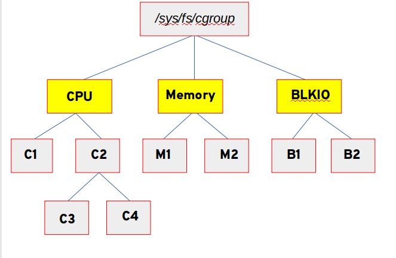
* v2
    * unified cgroup hierarchy
        ```bash
        mount -t cgroup2 none $MOUNT_POINT
        ```
        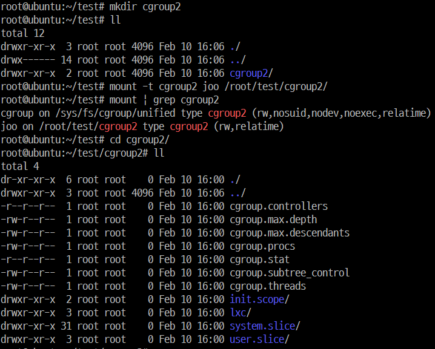
        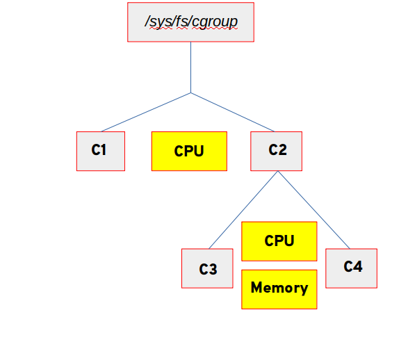


### subtree control(cgroup2) -> 아직 잘 모르겠다
* cgroup.controllers
    * read-only file
    * 해당 cgroup에 available한 controller의 list를 노출
    * 부모 cgroup의 cgroup.subtreee_control과 내용이 동일함???
* cgroup.subtree_control
    * 해당 cgroup에 활성화되어있는 controller 목록
    * 해당 cgroup의 cgroup.controllers에 있는 subset????
    * 이 파일에 +, -로 controller들을 활성화, 비활성화 가능
        ```bash
        echo '+pids -memory' > x/y/cgroup.subtree_control
        ```
        * cgroup.controllers에 없는 controller를 enable시키려하면 ENOENT 에러 발생
            ```bash
            cat cgroup.controllers        # 사용 가능한 controller 없음 확인
            echo "-io" > cgroup.subtree_control    # 문제 없음
            echo "+io" > cgroup.subtree_control    # cgroup.controllers에 없으므로 에러 발생
            ```
            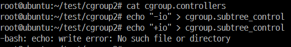


### thread mode (cgroup2)
* Linux 4.14에 추가
    * cpu와 같은 몇몇 controller들은 thread-level granularity 제어가 유용하기 때문
* root가 아닌 cgroup은 cgroup.type 파일이 있음
    * type value
        * domain(default)
            * nomal v2 cgroup
            * process-granularity
        * threaded
            * threaded subtree의 멤버 cgroup
            * process가 추가될 수 있고 controller가 활성화될 수 있음
        * domain threaded
            * threaded subtree의 root처럼 여겨지는 domain cgroup
        * domain invalid
            * threaded subtree 안에 있는 invalid 상태인 cgroup
            * process가 추가될 수 없고 controller도 활성화될 수 없음
            * 할 수 있는 단 한 가지 일은 이 cgroup을 threaded cgroup으로 바꾸는 것 뿐
* threaded controllers / domain controllers
    * threaded controllers
        * cpu, perf_event, pids
    * domain controllers
        * threaded subtree에서는 활성화될 수 없음


### deprecated v1 core features
1. Multiple hierarchies including named ones are not supported.
    * 같은 계층에 여러 controller를 mount할 수 있었음
    * named hierarchies
        * controller가 attach되지 않은 cgroup 계층도 mount 가능했었음
        * 각 계층은 unique한 이름을 가져야 함
        ```bash
        mount -t cgroup -o none,name=somename none /some/mount/point
        ```

2. All v1 mount options are not supported.
    * v1의 경우, 원래는 controller별로 mount가 가능했을 뿐 아니라 모든 controller를 mount 하는 기능이 있었음
    ```bash
    mount -t cgroup xxx /sys/fs/cgroup  # xxx는 cgroup과는 관계가 없고 /proc/mounts에 나타날 내용이므로 마음대로 유용하고 식별 가능한 이름을 사용하면 됨
    ```

3. The "tasks" file is removed and "cgroup.procs" is not sorted.
    * v1
        * tasks에 pid를 관리하고 cgroup.procs라는 파일에 tgid를 관리했었음
            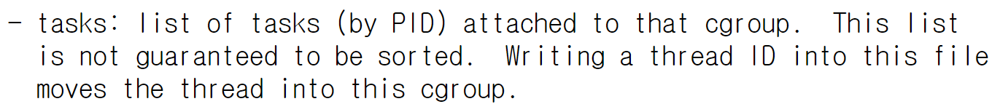
        * cgroup.procs는 tgid를 정렬하고 중복제거 했었음
            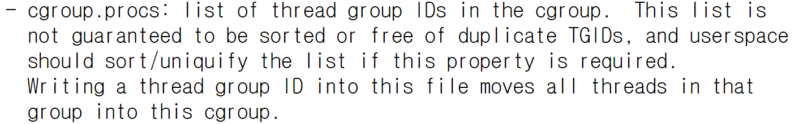
    * v2
        * croups.procs에 pid를 관리하고, 중복제거 및 정렬되지 않음

4. "cgroup.clone_children" is removed.
    * cpuset controller에만 영향을 미치는 flag
    * 1로 활성화되어있으면, 새로운 cpuset cgroup이 초기화하는 동안 부모로부터 설정을 복사했었음

5. /proc/cgroups is meaningless for v2.  Use "cgroup.controllers" file at the root instead.
    * v1
        * /proc/cgroups에 kernel에 compile되어 들어간 controller에 대한 정보를 담고 있음
        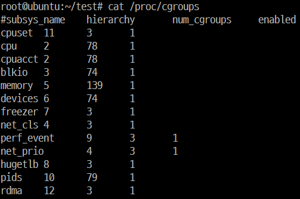
        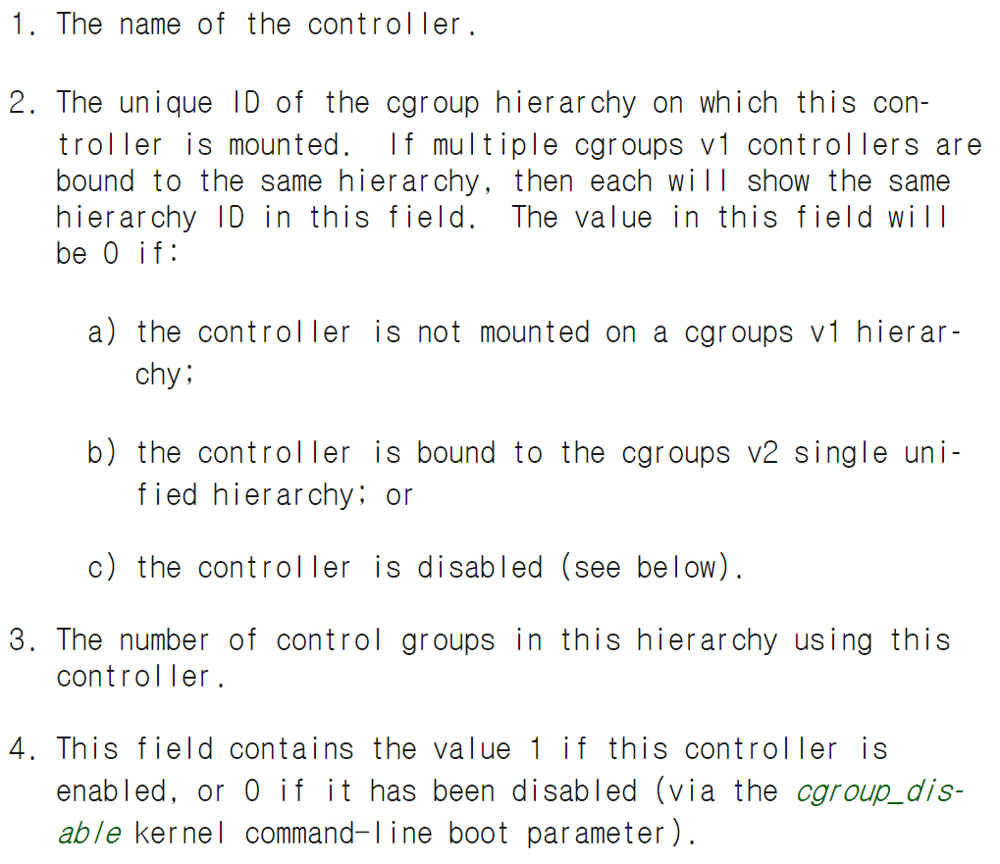
    * v2
        * cgroup2는 controller별로 mount하는 것이 아니기 때문에, 한 계층에 여러 controller가 mount되어있는지 여부를 관리할 필요가 없기 때문에 없어진 것 같음
        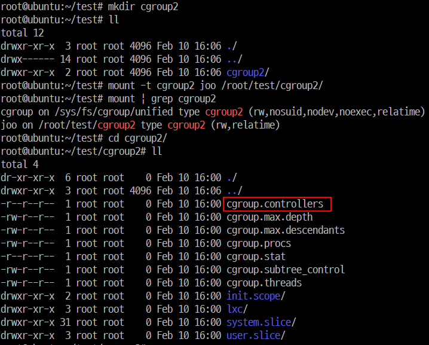


### v1에서의 이슈(v2의 근거)
1. Multiple Hierarchies
    * 문제점 @v1
        * v1은 임의의 계층을 만들 수 있고, 각 계층에 몇 개의 controller가 mount되어도 상관없었음. 이것은 flexibility를 보장하는 것 같았지만, 실상은 유용하지 않았음
            * cpu, cpuacct와 같은 밀접하게 관련된 것들만 같은 계층에 mount되어 사용됨
            * 결국 사용자가 각 계층마다 비슷한 계층구조를 반복해서 만들게 됨
        * 이에 대한 core 구현이 너무 복잡하여 비용이 큼
        * 계층이 몇개가 되던 limit이 없었음
        * 다른 controller의 토폴로지를 예상할 수 없었기 때문에, 각 controller는 다른 모든 controller가 완전히 직교 계층 구조에 연결되어있다고 생각해야 함
            * 일반적으로 요구되는 것은, 특정 controller에 따라 다른 수준의 granularity(세분성)을 갖는 것
                * ex) 특정 레벨 전까지는 memory는 관리 안하고, CPU 관리는 하길 바라는 등
    * 개선 @v2
        * 모든 controller가 하나의 계층에 mount됨
        * subtree control로 controller 관리

2. Thread Granularity
    * 문제점 @v1
        * v1은 thread가 다른 cgroup에 속할 수 있었음
            * 몇몇 controller와는 사상이 맞지 않음
                * ex) 하나의 process에 있는 thread들은 memory를 공유하므로 다른 memory cgroup에 속할 수 없음
        * v1은 모호하게 정의된 delegated(위임) 모델이어서, thread granularity(세분성)이 남용됨
            * cgroup은 개별 application에 위임되어서, 자체적으로 하위 계층을 만들고 관리하고 그에 따른 리소스 분배를 제한할 수 있었음
            * cgroup은 이렇게 노출되기 때문에 근본적으로 부적절한 interface를 갖고 있음
                * /proc/self/cgroup에서 대상 계층 구조의 path를 추출  
                -> knob(손잡이) 이름을 path에 추가하여 path를 구성  
                -> open하여 read/write함
    * 개선 @v2
        * process granularity
            * process 단위로 cgroup에 속할 수 있음
            * 하나의 process에 속하는 모든 thread는 같은 cgroup에 속함
            * Linux 4.14의 thread mode 추가로 인해 rule이 몇몇 case에 대해서 완화됨

4. Other Interface Issues -> 잘 모르겠다
    * core에서 empty cgroup에 알림을 보내는 것 관련하여 event 전달 매커니즘이 이상함
    * controller 역시 계층적 조직을 완전히 무시하고 모든 cgroup을 마치 root cgroup 바로 아래에 있는 것처럼 취급하여 문제가 많음

5. Controller Issues and Remedies
    * Memory
        * soft limit / hard limit 관련 이슈 개선


### 왜 cgroup v2로 빨리 migrate할 수 없는가?
* device controller와 freezer에 대한 지원이 없어서 container한테 유용하지 않았음
    * device controller가 없어서 container 안의 root user가 device file에 바로 접근할 수 있음
    * container를 freeze할 수 없어서 TOCTOU 공격에 예방하지 못함
    * 4.15 (2018/01)에 device controller 지원
    * 5.2에 freezer 지원
* v1과 v2은 호환되지 않기 때문에, v1에서 v2로 migrate하는 것이 어려움
    * v1과 v2를 혼합해서 사용하는 hybird 옵션이 있긴 하지만, 이미 v1에 활성화되어있는 controller를 v2에 활성화시키지 못하므로 container에 잘 사용되지 않음


### cgroup2 사용처
* Linux 배포판
    * Fedora 31에 default로 adopt됨
    * Linux 4.2 이상이고 systemd가 v226 이상인 경우, systemd.unified_cgroup_hierarchy=1 옵션을 kernel argument에 추가하면 동작
* low-level container runtimes
    * runc
        * 최초 지원 시작(2019/09, https://github.com/opencontainers/runc/pull/2113)
        * 여러 문제로 아직 정식으로 지원하지는 않음
            * 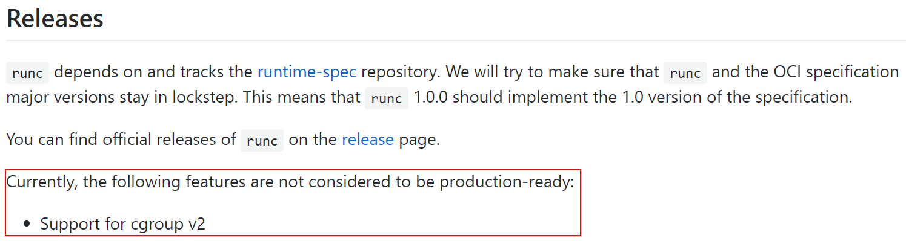
        * Issue Tracking
            * https://github.com/opencontainers/runc/issues?utf8=%E2%9C%93&q=is%3Aissue+is%3Aopen+cgroup2
    * crun
        * Red Hat이 이끌고 있는 OCI Runtime Spec
        * cgroup v2 full support 제공
        * Fedora 31에 default runtime으로 adopt됨
    * lxc
        * merge된 PR들이 보이긴 하는데...?
            * https://github.com/lxc/lxc/pull/2897
            * https://github.com/lxc/lxc/pull/3120
            * https://github.com/lxc/lxc/pull/3194
* high-level container runtimes
    * containerd
        * Merged
            * https://github.com/containerd/containerd/pull/3799
        * Tracking Issue
            * https://github.com/containerd/containerd/issues/3726
    * Docker / Moby
        * Merged
            * https://github.com/moby/moby/pull/40174
        * Tracking Issue
            * https://github.com/moby/moby/issues/40360
    * Podman
        * crun과 함께 지원
        * Fedora 31이라면 별도의 설정 변경 없이 사용 가능
        * cpu controller에 대한 제한 사항이 있음
            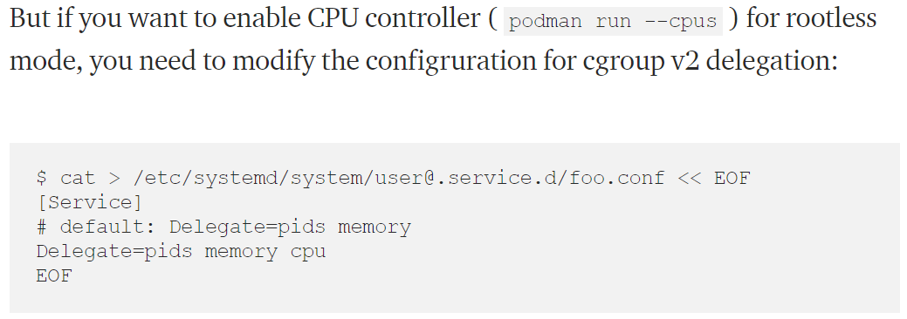
* Kubernetes
    * KEP(Kubernetes Enhancement Proposal) 추가를 위한 PR opened
        * https://github.com/kubernetes/enhancements/pull/1370
    * alpha version 2020
    * fully support 2021~2022


## 참고 링크
* http://man7.org/linux/man-pages/man7/cgroups.7.html
* https://www.kernel.org/doc/Documentation/cgroup-v2.txt
* https://www.kernel.org/doc/Documentation/cgroup-v1/cgroups.txt
* https://www.redhat.com/en/blog/world-domination-cgroups-rhel-8-welcome-cgroups-v2
* http://www.man7.org/conf/lca2019/cgroups_v2-LCA2019-Kerrisk.pdf
* https://medium.com/nttlabs/cgroup-v2-596d035be4d7
* https://serverfault.com/questions/929080/list-of-controllers-empty-with-cgroup-v2
* https://github.com/opencontainers/runc#releases