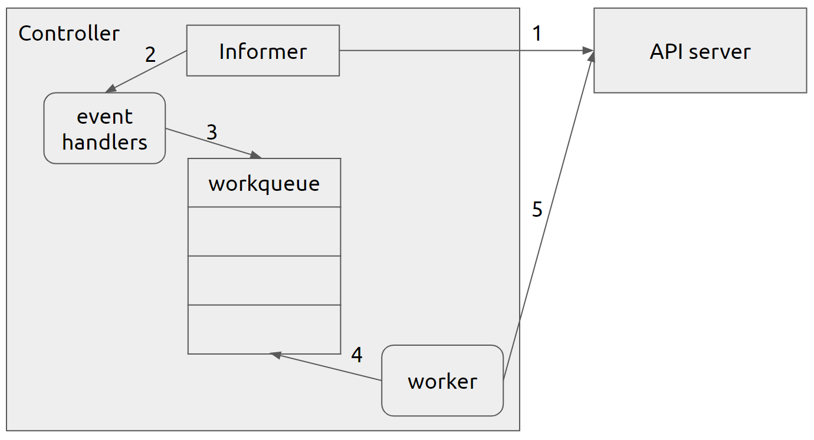
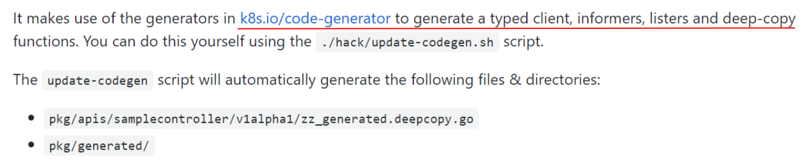
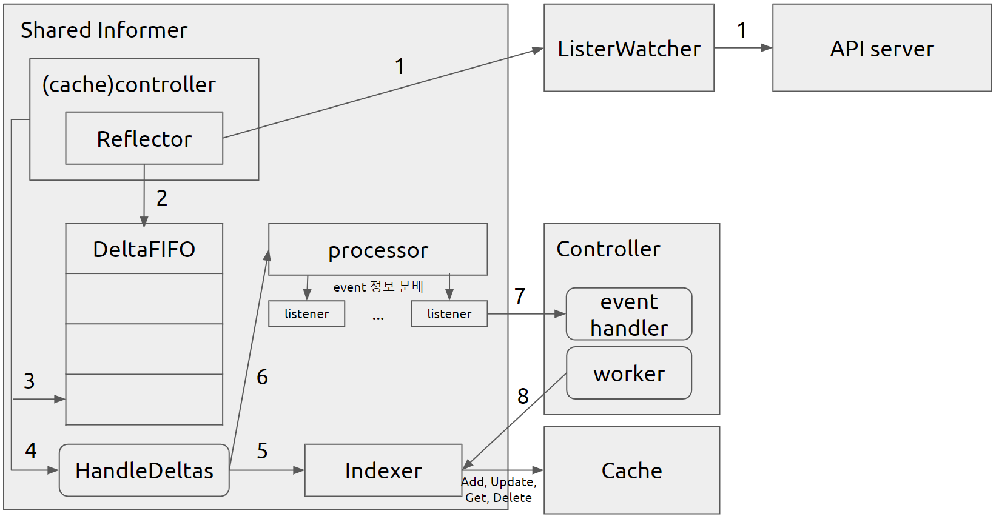

# Controller #
* cluster의 current state를 desired state가 될 수 있도록 만들어주는 k8s의 component
* 동작
    * 특정 resource의 변경 사항에 대해서 API 서버를 watch
    * 변경 사항에 대한 operation(reconciliation loop)을 수행함

## kube-controller-manager ##
* control-plane(master node)에 pod으로 떠있음
* 여러 controller를 단일 process로 결합하여 복잡도를 줄임
    * 각 controller는 goroutine(Go 런타임이 관리하는 가상 thread)으로 실행됨

### 대표적인 Controller들 ###
* ReplicaSet Controller
    * watch하는 object : ReplicaSet, Pod
    * reconciliation loop : pod selector가 일치하는 pod의 수를 count하고, desired Replica 수와 비교하여 조절
* Deployment Controller
    * watch하는 object : Deployment, ReplicaSet, Pod
    * reconciliation loop
        * Deployment object가 변경되었을 때 새로운 version으로 rollout을 수행
        * ReplicaSet을 생성하고, 기존 Pod들이 새로운 것들로 바뀔 때까지 기존 ReplicaSet과 새로운 ReplicaSet를 적절히 scale함
            * Pod을 직접 생성하는 것이 아님!
* Node Controller
    * watch하는 object : Node
    * reconciliation loop : node의 health를 monitor하고 unreachable node로부터 pod을 evict
* Namespace Controller
    * watch하는 object : Namespace
    * reconciliation loop : Namespace 삭제 시 속한 모든 resource를 삭제함
* 그 외 : DaemonSet, Job, StatefulSet, Service, Endpoint, PersistentVolume Controller 등

## Controller의 Architecture ##
* informer
    * 특정 resource(API object)에 대한 변경 사항을 listen하고 있다가 업데이트할 때마다 호출되는 listener
* event handler function
    * resource가 Add되었을 때, Update되었을 때, Delete되었을 때 불릴 함수를 informer에 event handler function으로 등록할 수 있음
        * ex. sample controller의 informer에 deployment에 대한 event handler function을 등록하는 부분 - [코드](https://github.com/kubernetes/kubernetes/blob/92a14f4f7ef11c580961f0aebe491d0ff148e191/staging/src/k8s.io/sample-controller/controller.go#L128)
* worker() : reconciliation loop. workqueue에서 작업을 하나씩 pop하여 수행

## Controller의 workflow ##

1. informer가 특정 resource에 대해서 API server를 watch
2. watch하고 있던 resource에 변화가 생기면, informer가 등록된 event handler function을 호출
3. event handler function에서 workqueue에 변경 사항에 대한 정보를 enqueue
4. worker()에서 workqueue를 감시하고 있다가, item이 생기면 dequeue하여 처리함
    * ex. sample controller의 Run()
        * [주기적으로 runWorker() 실행](https://github.com/kubernetes/kubernetes/blob/92a14f4f7ef11c580961f0aebe491d0ff148e191/staging/src/k8s.io/sample-controller/controller.go#L166)
        * [processNextWorkItem()에서 workqueue pop](https://github.com/kubernetes/kubernetes/blob/92a14f4f7ef11c580961f0aebe491d0ff148e191/staging/src/k8s.io/sample-controller/controller.go#L187)
        * [reconciliation loop(syncHandler()) 실행](https://github.com/kubernetes/kubernetes/blob/92a14f4f7ef11c580961f0aebe491d0ff148e191/staging/src/k8s.io/sample-controller/controller.go#L219)
5. 처리 과정에서 필요 시, API server에 요청을 보내거나 Event를 생성
    * ex. replica 수가 모자라서 API server에 Pod 생성 요청 및 event 발행

# Informer #
* 동작
    * API 서버를 통해 특정 resource의 변경 사항을 파악
    * 이 정보를 기반으로 현재 cluster state에 대한 cache(indexer)를 관리
    * 등록된 handler 함수를 호출하여 변경 사항에 대해서 client에게 알림
* shared informer
    * informer마다 cache를 갖고 있으면 memory가 낭비되므로, 모든 informer들이 cache를 공유하도록 만듦
    * 따라서 shared informer를 생성할 때는 sharedInformerFactory에 생성 요청을 해야함
* CRD(Custom Resource Definition) 사용 시
    * CRD에 대한 informer를 직접 다 만들 필요가 없이, code-generator를 사용하면 알아서 만들어 줌
    * 따라서 CRD에 대해서는 Custom Controller만 작성하면 됨

## Informer의 Architecture ##
* Reflector
    * API server와 실제로 통신하는 component
    * ListAndWatch()가 주기적으로 실행
        * [ListWatch inferface](https://github.com/kubernetes/client-go/blob/master/tools/cache/listwatch.go)를 구현한 object를 사용
        * API server를 watch하다가 event(resource에 변경 사항이 생김)가 발생하면 event type에 따라 DeltaFIFO에 변경 사항 정보를 Add, Update, Delete
* DeltaFIFO
    * 변경된 object와 변경 유형을 포함하는 delta 구조체의 instance를 저장하는 queue
* (cache) controller
    * DeltaFIFO에서 item을 pop하여 HandleDeltas()를 호출하여 처리, Indexer(cache)를 업데이트
* processor와 listener
    * listener의 list를 관리하면서 event를 listener에 분배
    * event handler function을 추가할 때마다 listener가 추가됨
    * processor가 listener에 event를 분배하면, listener는 event handler function을 호출함으로써 informer에서 controller로 object 정보를 넘김
* cache
    * shared informer의 구현체는 sharedIndexerInformer이고 Indexer를 공유한다
    * Indexer는 cache를 바라보며 Add, Update, Delete를 실행
    * cache의 구현체는 ThreadSafeMap
        * shared memory를 사용하는 부분은 코드에서 보지 못했으므로 process마다 갖고있다고 봐야할 것 같음
        * 따라서 kube-controller-manager는 모든 controller가 하나의 process로 뜨니까 같은 cache를 보고 있지만, 다른 process로 뜬 controller는 cache를 따로 갖고 있을 듯

## Informer의 workflow ##

1. Reflector가 ListerWatcher를 통해 API 서버에서 resource의 변경 사항을 알아옴
2. 변경 사항을 DeltaFIFO에 Add
3. (cache)controller가 DeltaFIFO를 감시하다가 item이 생기면 Pop
4. (cache)controller가 pop한 item에 대해서 HandleDeltas()를 실행
5. HandleDeltas()에서 Indexer를 통해 cache에 변경 사항을 반영
6. HandleDeltas()에서 processor에게 변경 사항에 대한 event 분배를 요청
7. listener가 event handler function 호출
8. worker가 item을 처리하는 과정에서 original object를 Indexer을 통해 Get