# Kubernetes에서 swap 사용하는 방법
* edited : 2020/02/05


## kubernetes는 swap을 사용하지 않는 것을 권장한다
* [이러한 이유들 때문인데...](https://www.evernote.com/l/AWjKo9GOS9pFFp7JEYCZkBXiRvpQe6W3jtw/)
    * 요약하자면, **QoS 개념과 상충**될 뿐더러 swap을 지원하려면 고려해야할 게 많으므로 당장은 생각하지 않겠다는 입장
* swap을 무시하는 옵션은 deprecated 예정
    * 1.17.1 버전에서 동작하는 것을 확인했으나, 언제 지원을 중단할 지 모름


## 그럼에도 불구하고 swap을 써보겠다면...
* 테스트한 kubernetes 버전
    ```bash
    kubectl get nodes
    ```
    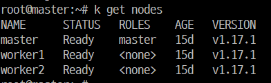


### kubernetes 구성할 때 swap을 무시해보자
* swap 파티션 만들고 켜기
    ```bash
    fallocate -l 1G /swapfile
    dd if=/dev/zero of=/swapfile bs=1024 count=1048576
    mkswap /swapfile
    swapon /swapfile
    swapon --show
    ```
    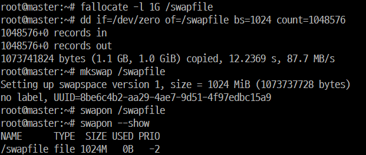
* kubelet config 변경 후 적용
    * kubeadm init 전에는 /var/lib/kubelet/config.yaml이 없다는 메세지가 출력되면서 kubelet 재기동이 되지 않는다.  
    kubeadm init할 때 어차피 kubelet 기동하는 단계가 있으므로 일단 config 적용까지만 한다.
    ```bash
    sed -i '9s/^/Environment="KUBELET_EXTRA_ARGS=--fail-swap-on=false"\n/' /etc/systemd/system/kubelet.service.d/10-kubeadm.conf
    systemctl daemon-reload
    ```
    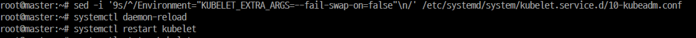
* kubeadm init 시 --ignore-preflight-errors 옵션 추가
    * 사용할 CNI에 따라 추가해야하는 옵션이 다르다. flannel을 사용하는 예시이다.
        ```bash
        kubeadm init --pod-network-cidr=10.244.0.0/16 --ignore-preflight-errors=Swap
        ```
        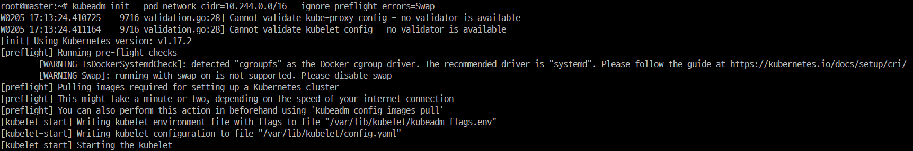
    * kube config를 복사(kubeadm init 결과를 잘 복사해둘 것)  
        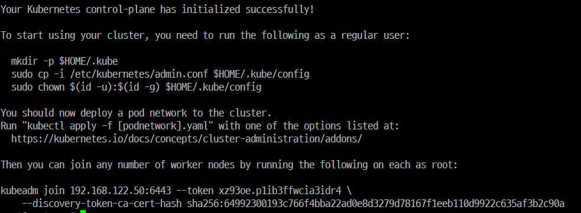
        ```bash
        mkdir -p $HOME/.kube
        sudo cp -i /etc/kubernetes/admin.conf $HOME/.kube/config
        sudo chown $(id -u):$(id -g) $HOME/.kube/config
        ```
        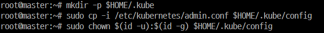
* kubelet 상태 확인
    ```bash
    systemctl status kubelet
    ```
    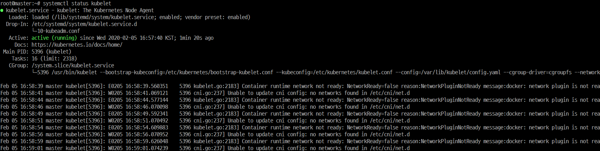
* worker node도 swap을 켜고 kubelet config를 바꾸기
    ```bash
    fallocate -l 1G /swapfile
    dd if=/dev/zero of=/swapfile bs=1024 count=1048576
    mkswap /swapfile
    swapon /swapfile
    swapon --show
    ```
    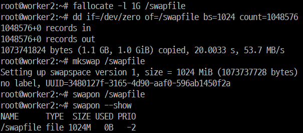
    ```bash
    sed -i '9s/^/Environment="KUBELET_EXTRA_ARGS=--fail-swap-on=false"\n/' /etc/systemd/system/kubelet.service.d/10-kubeadm.conf
    systemctl daemon-reload
    ```
    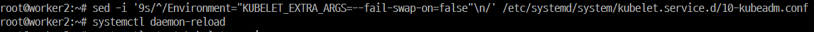
* node join 시 --ignore-preflight-errors=Swap 추가
    ```bash
    kubeadm join 192.168.122.50:6443 --token xz93oe.p1ib3ffwcia3idr4 --discovery-token-ca-cert-hash sha256:64992300193c766f4bba22ad0e8d3279d78167f1eeb110d9922c635af3b2c90a --ignore-preflight-errors=Swap
    ```
    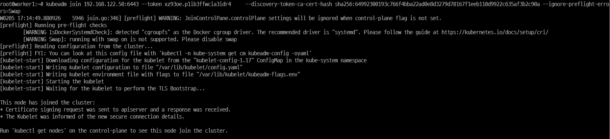


### 이미 구성한 kubernetes에서 swap을 켜보자
* worker2의 kubelet 상태 확인
    ```bash
    systemctl status kubelet
    ```
    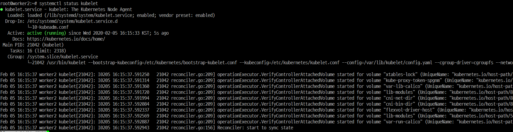
* swapon /swapfile 후 kubelet 재기동
    ```bash
    swapon /swapfile
    swapon --show
    systemctl restart kubelet
    systemctl status kubelet
    ```
    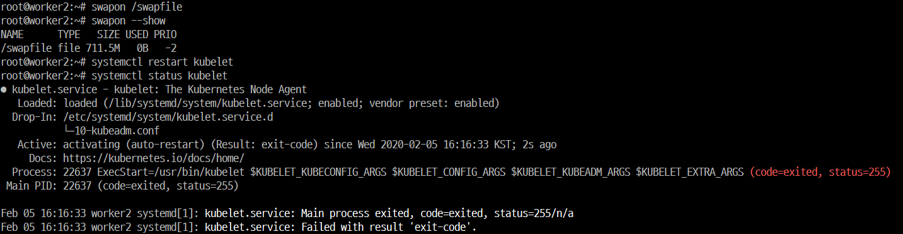
* kubelet configure 파일 수정
    ```bash
    sed -i '9s/^/Environment="KUBELET_EXTRA_ARGS=--fail-swap-on=false"\n/' /etc/systemd/system/kubelet.service.d/10-kubeadm.conf
    systemctl daemon-reload
    systemctl restart kubelet
    ```
    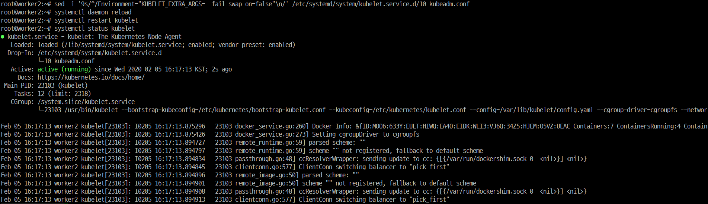


## kubelet에서 swap check하는 코드
* --fail-swap-on은 default로 true
    * 옵션 사용 시 경고 문구로 deprecated되었다고 나오지만 아직 동작함
* --fail-swap-on이 true인 경우, /proc/swaps를 읽어서 swap 여부 확인 ([소스코드](https://github.com/kubernetes/kubernetes/blob/33aa665c344f91c10a15f0efda730e171b544d96/pkg/kubelet/cm/container_manager_linux.go#L209))
    * 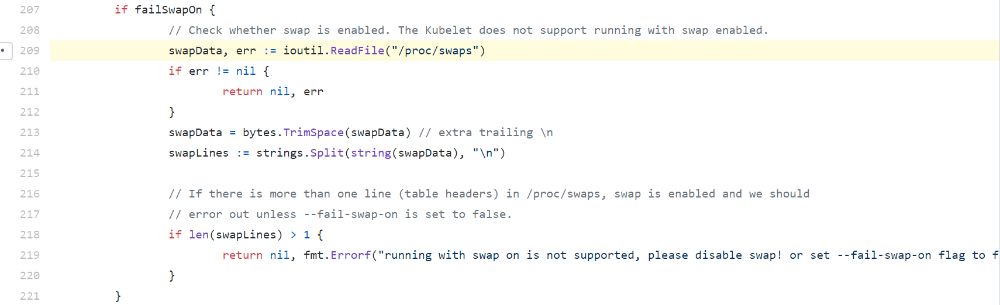
        * swap을 사용할 경우, /proc/swaps에서 두 번째 줄이 존재함  
            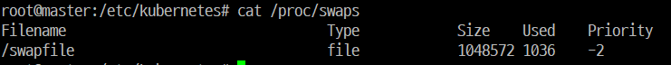
        * swap을 사용하지 않는 경우, 두 번째 줄은 존재하지 않음  
            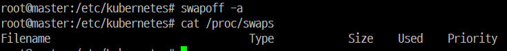