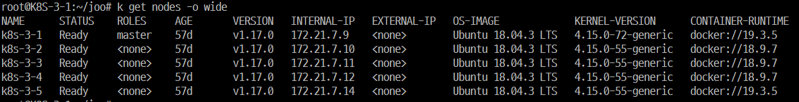
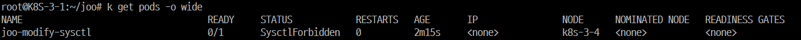
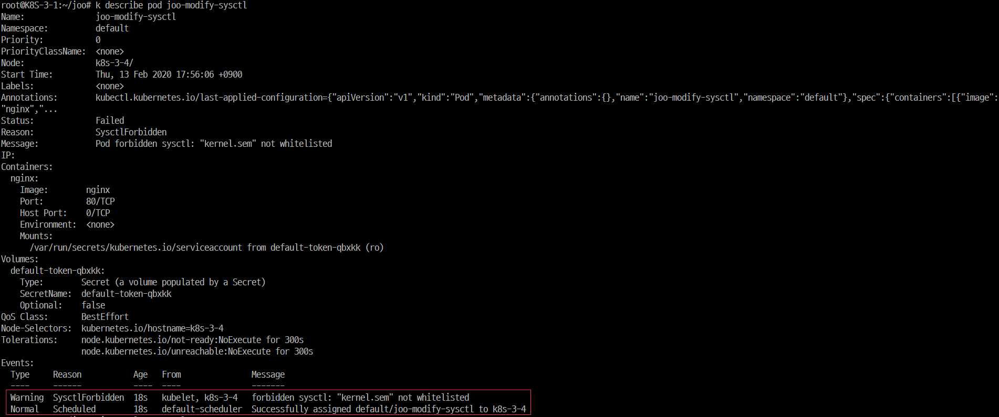
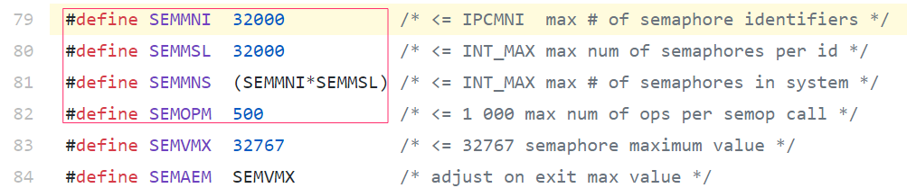
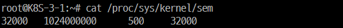
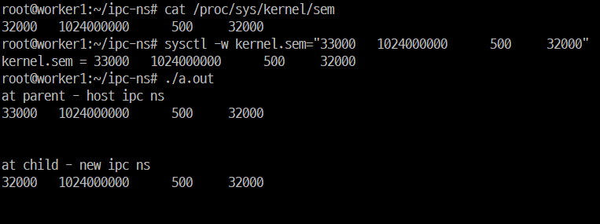

# Kubernetes에서 sysctls 설정 변경하는 방법
* proc file system과 sysctl command, ipc namespace 분리 테스트까지
* edited : 2020/02/13

## proc file system과 sysctl command
### proc file system
#### proc file system이란
* Unix 계열 OS에서 프로세스와 다른 시스템 정보를 계층적인 파일 구조 같은 형식으로 보여주는 pseudo filesystem
* 부트 타임에 /proc이라는 마운트 포인트에 매핑
* 커널에서 내부 데이터 구조체에 대한 인터페이스처럼 행동
    * 커널 영역과 사용자 영역 사이의 통신에 대한 방식 제공
* 런타임(sysctl) 시에 특정한 커널 파라미터를 바꾸고 시스템에 대한 정보를 얻는데 사용될 수 있음

#### /proc 하위 구조
* /proc/{PID}
    * (커널 프로세스를 포함하는) 실행 중인 프로세스 별로 디렉토리가 존재
* /proc/crypto
    * 사용 가능한 암호화 모듈들에 대한 목록
* /proc/devices
    * 장치 ID에 의해 정렬된 캐릭터와 블록 장치 뿐 아니라 /dev 이름에 대한 목록
* /proc/filesystems
    * 리스팅 시의 커널에 의해 지원되는 파일 시스템들의 목록
* /proc/sys
    * 동적으로 설정 가능한 커널 옵션들에 대한 인터페이스
* (생략)

#### 왜 proc file system을 사용하는가?
* 파일 시스템 오버 헤드를 줄일 수 있음
    * 일반적인 파일시스템은 오버헤드가 많다
        * 각 파일의 inode, superblocks와 같은 객체를 관리해야 함
        * 이런 정보를 필요할 때마다 OS에 요청해야 함
        * 이런 정보들은 서로 어긋날 수도 있고, 단편화 현상이 발생할 수도 있음
    * procfs은 리눅스 커널에서 직접 파일시스템을 관리하는 방법을 채택
    * procfs은 커널메모리에서 돌아가는 가상 파일 시스템
* 물리적인 파일시스템 장치를 필요로 하지 않음
    * 커널 메모리에서 유지하는 파일 시스템
* 최적화된 파일 작업 수행
    * proc 하위 파일들은 고정적이고 처리해야할 데이터 양이 적으므로, open/read/write/close 등을 사용하여 데이터를 다루는 것이 비효율적

#### proc 프로그래밍
##### user와 데이터 교환법
* procfs의 데이터는 파일에 저장되는 것이 아니라 커널 메모리에 저장하며, 커널 메모리는 유저레벨에서 직접 접근 불가능
    * user가 cat(혹은 read 함수)를 통해 파일의 내용을 읽으려하면, 커널에서 데이터를 유저에게 일정한 포맷으로 뿌려줌
    * user가 어떤 내용을 proc 파일에 쓰게되면 데이터를 받아들이고 가공해서 커널 메모리에 로드
* kernel와 user 사이에 데이터를 전달해주는 callback 함수를 등록시켜서 사용
    ```c
    # pric_dir_entry에 read/write를 위한 callback 함수를 등록
    struct proc_dir_entry *entry;

    entry->read_proc = read_proc_foo;
    entry->write_proc = write_proc_foo;
    ```

#### proc file system 소스 코드
* https://github.com/torvalds/linux/tree/master/fs/proc


### sysctl command
* 동작
    * 동적으로 커널 파라미터를 설정
    * /proc/sys 하위에 있는 파라미터만 가능
* 사용법
    * sysctl -w {param}="{value}"
        * 일시적으로 해당 파라미터를 설정
        * 재부팅 시 유지되지 않음
    * sysctl -p{file_path}
        * file_path로부터 sysctl 설정을 로드
        * file_path가 주어지지 않으면 /etc/sysctl.conf을 로드
* 참고
    * 부팅 시점에 /proc mount 후 sysctl에 의해 /etc/sysctl.conf가 자동으로 로드됨


## K8S에서의 sysctl 설정 방법
* K8S에서 커널 파라미터 변경을 위해 sysctls spec을 설정할 수 있음
* sysctls
    * safe와 unsafe 파라미터를 구분하여 관리
    * safe 파라미터는 default로 enable
        * kernel.shm_rmid_forced
        * net.ipv4.ip_local_port_range
        * net.ipv4.tcp_syncookies
    * unsafe 파라미터는 cluster admin을 통해 node별로 enable해야 함
        * disabled unsafe sysctls를 사용한 pod은 스케줄링까지는 되지만, launch는 실패
* unsafe sysctls를 enable하는 방법
    * node별로 kubelet에 다음과 같은 설정을 추가하여 기동
        ```bash
        kubelet --allowed-unsafe-sysctls ‘{원하는 kernel 파라미터}’ ...
        ```


## 테스트

### 테스트 환경


### 테스트 과정
* enable되지 않은 unsafe 파라미터를 수정하는 pod deploy
    ```yaml
    apiVersion: v1
    kind: Pod
    metadata:
    name: joo-modify-sysctl
    spec:
    securityContext:
        sysctls:
        - name: kernel.sem
        value: "10000   1024000000      500     32000"
    containers:
        - name: nginx
        image: nginx
        ports:
            - containerPort: 80
            name: http
    ```

    ```bash
    root@K8S-3-1:~/joo$ k apply -f sysctl_test.yaml
    pod/joo-modify-sysctl created
    ```
    
    

* kubelet config에 sysctl unsafe parameter 활성화
    * kubelet 설정에 --allowed-unsafe-sysctls 'kernel.sem' 추가
        ```bash
        root@K8S-3-5:~$ vi /etc/systemd/system/kubelet.service.d/10-kubeadm.conf
        ```
        ```bash
        # Note: This dropin only works with kubeadm and kubelet v1.11+
        [Service]
        Environment="KUBELET_KUBECONFIG_ARGS=--bootstrap-kubeconfig=/etc/kubernetes/bootstrap-kubelet.conf --kubeconfig=/etc/kubernetes/kubelet.conf"
        Environment="KUBELET_CONFIG_ARGS=--config=/var/lib/kubelet/config.yaml"
        Environment="KUBELET_EXTRA_ARGS=--feature-gates=DevicePlugins=true --allowed-unsafe-sysctls 'kernel.sem'"
        # This is a file that "kubeadm init" and "kubeadm join" generates at runtime, populating the KUBELET_KUBEADM_ARGS variable dynamically
        EnvironmentFile=-/var/lib/kubelet/kubeadm-flags.env
        # This is a file that the user can use for overrides of the kubelet args as a last resort. Preferably, the user should use
        # the .NodeRegistration.KubeletExtraArgs object in the configuration files instead. KUBELET_EXTRA_ARGS should be sourced from this file.
        EnvironmentFile=-/etc/default/kubelet
        ExecStart=
        ExecStart=/usr/bin/kubelet $KUBELET_KUBECONFIG_ARGS $KUBELET_CONFIG_ARGS $KUBELET_KUBEADM_ARGS $KUBELET_EXTRA_ARGS
        ```
    * 설정 reload
        ```bash
        root@K8S-3-5:~$ systemctl daemon-reload
        ```
    * kubelet restart
        ```bash
        root@K8S-3-5:~$ systemctl restart kubelet
        ```

* pod 다시 deploy
    * deploy 성공
        ```bash
        root@K8S-3-1:~/joo$ k get pods -o wide
        NAME                                   READY     STATUS              RESTARTS   AGE       IP                NODE      NOMINATED NODE   READINESS GATES
        joo-modify-sysctl                      0/1       ContainerCreating   0          2s        <none>            k8s-3-5   <none>           <none>
        ```
    * kernel.sem 비교
        ```bash
        root@K8S-3-1:~$ cat /proc/sys/kernel/sem
        32000   1024000000      500     32000
        root@K8S-3-1:~$ k exec -it joo-modify-sysctl /bin/bash
        root@joo-modify-sysctl:/$ cat /proc/sys/kernel/sem
        10000   1024000000      500     32000
        ```


## kernel.sem 기본값 확인
* kernel src :  https://github.com/torvalds/linux/blob/v4.15/include/uapi/linux/sem.h#L79
    
* cat /proc/sys/kernel/sem  
    
    * SEMMSL: max semaphores per array
    * SEMMNS: maximum semaphores system-wide
    * SEMOPM : maximum operations per semop call
    * SEMMNI: maximum arrays

## IPC namespace 분리 시 kernel.sem 값 확인
kernel.sem parameter는 IPC namespace가 분리되면 host와 다른 값(default 값)을 가짐  
parameter별로 어떤 namespace에 의해 분리되는지는 다름
### 테스트 과정
* default kernel.sem 확인
    * cat /proc/sys/kernel/sem
* sysctl로 kernel.sem 변경
    * sysctl -w kernel.sem="33000   1024000000 500 32000"
* host ipc namespace에서의 kernel.sem을 출력하고, 새로운 ipc ns를 갖는 자식 process를 생성하여 kernel.sem을 출력하는 프로그램 실행
    
* a.out 소스
    ```c
    #define _GNU_SOURCE
    #include <stdio.h>
    #include <stdlib.h>
    #include <sched.h>
    #include <signal.h>
    #include <sys/types.h>
    #include <sys/wait.h>

    static char child_stack[1048576];

    static int child_fn() {
            printf("at child - new ipc ns\n");
            system("cat /proc/sys/kernel/sem");
            printf("\n\n");
            return 0;
    }

    int main() {
            printf("at parent - host ipc ns\n");
            system("cat /proc/sys/kernel/sem");
            printf("\n\n");


            pid_t child_pid = clone(child_fn, child_stack+1048576, CLONE_NEWIPC | SIGCHLD, NULL);


            waitpid(child_pid, NULL, 0);
            return 0;
    }
    ```

## 참고 링크
* https://en.wikipedia.org/wiki/Procfs
* https://www.tldp.org/LDP/Linux-Filesystem-Hierarchy/html/proc.html
* https://www.joinc.co.kr/w/Site/system_programing/proc/ProcFsPrograming
* http://jake.dothome.co.kr/proc/
* http://man7.org/linux/man-pages/man2/sysctl.2.html
* http://man7.org/linux/man-pages/man8/sysctl.8.html