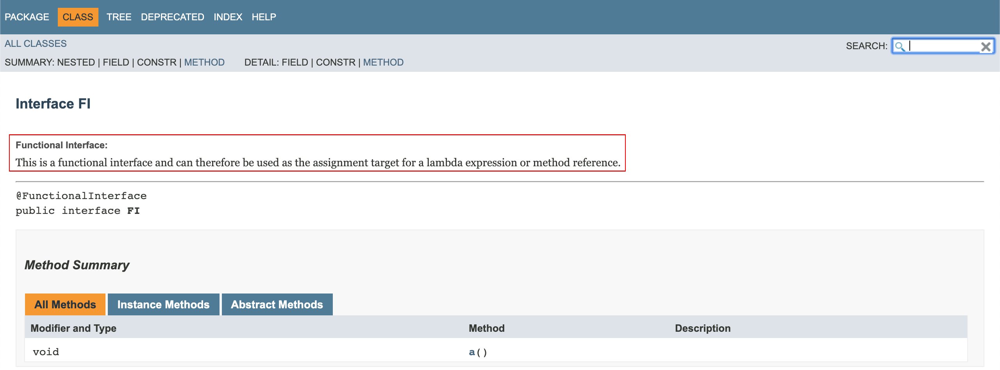
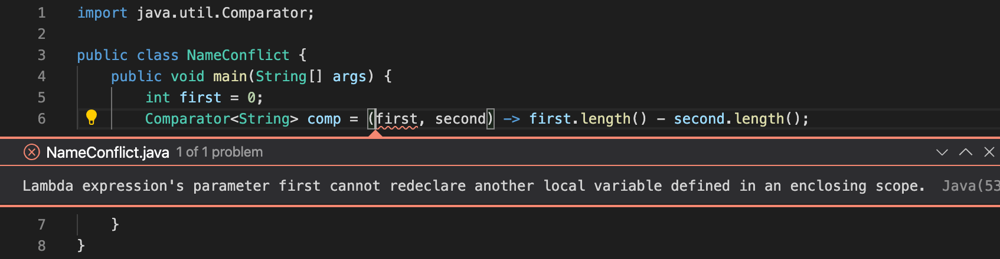

## 3장 인터페이스와 람다 표현식(3)

### 함수형 인터페이스(Java 8)
* **abstract method가 1개만** 있는 인터페이스
    * default, static, private method가 여러 개 있더라도 abstract method가 1개면 함수형 인터페이스
* annotation으로 명시적으로 선언 가능
    ```java
    @FunctionalInterface
    interface FI {
        public void a();
    }
    ```
    * annotation 추가한 상태에서, abstract method가 1개를 초과하면 아래와 같은 에러를 출력함
    
    * javadoc에 다음과 같이 추가됨
    

### 람다 표현식 (Java 8)
* 나중에 한 번 이상 실행할 수 있게 전달하는 코드 블록
* 문법
    ```java
    ( parameters ) -> expression body   // expression이 1줄일 때
    ( parameters ) -> { expression body }
    () -> expression body   // parameter가 없을 때
    () -> { expression body }
    ```
* 구성 요소
    * 코드 블록
    * 매개변수
    * 자유 변수들의 값
        * [자유 변수](#자유-변수) 참고

#### 타입 추론
* 컴파일러가 타입을 추론하여 기대하는 타입과 일치하는 지 검사함
* 람다 표현식에서 매개변수 타입은 생략 가능, 리턴 타입은 명시하지 않음
    ```java
    (String s) -> s.length()    // 매개변수 타입을 명시해도 됨
    (s) -> s.length()           // 매개변수 타입을 생략해도 컴파일러가 추론
    s -> s.length()             // 매개변수가 1개인 경우 ()를 생략해도 됨
    ```

#### 함수형 인터페이스 자리에 사용할 수 있다
* 람다 표현식을 **함수형 인터페이스 타입 변수에 저장**해서 해당 인터페이스의 인스턴스로 변환할 수 있음
    * Object는 함수형 인터페이스가 아니라 class이므로, 람다를 Obejct 타입 변수에 저장할 수 없음
* Comparator<String>을 구현한 클래스의 객체 대신에 lambda를 사용한 예
    ```java
    Arrays.sort(words, (first, second) -> first.length() - second.length());
    ```
* lambda 도입 이전의 코딩 방식과 비교
    * [Runnable interface를 implement하는 class를 사용](../example_code/lambda/MyRunnable.java)
    * [익명 클래스를 사용](../example_code/lambda/UsingAnonymousClass.java)
    * [람다 표현식을 사용](../example_code/lambda/UsingLambda.java)

#### 지연 실행(deferred execution)
* 람다는 결국 **나중에 실행하도록 전달할 수 있는 코드 블록**이라고 볼 수 있다
    * 바로 실행할 코드 블록이라면 람다를 쓸 이유가 없다!
    * [연습 코드](../example_code/lambda/DeferredExecution.java)
* 예시
    * 별도의 스레드에서 코드 실행
    * 코드를 여러 번 실행
    * 알고리즘에서 적절한 시점에 코드 실행(예를 들어 정렬에서 비교 연산)
    * 어떤 일(버튼 클릭, 데이터 수신 등)이 일어날 때 코드 실행
    * 필요할 때만 코드 실행

#### 변수 유효 범위
* 중첩 블록의 유효 범위와 같음
    * 새로운 변수 범위를 생성하지 않는다
    * 람다 안에 지역 변수와 이름이 같은 매개변수나 다른 지역 변수를 선언하면 안 됨
    
    * 람다 안의 this는 해당 람다 표현식을 생성하는 메서드의 this 매개변수
* 자유 변수
    * 매개변수가 아니며 직접 선언한 것도 아닌 변수
        ```java
        public static void repeatMessage(String text, int count) {
            Runnable r = () -> {
                for (int i = 0; i < count; i++) {
                    System.out.println(text);
                }
            };
            new Thead(r).start();
        }

        public static void main(String[] args) {
            repeatMessage("hello", 100);    // "hello"와 100이 자유변수
        }
        ```
    * 람다는 자유 변수 값들을 **캡처**함
    * 람다는 자신을 감싸는 유효 범위에 속한 **사실상 최종(effectively final, 값이 변하지 않는 변수)** 지역 변수에만 접근할 수 있음
        ```java
        for (int i = 0; i < n; i++) {
            new Thread(() -> System.out.println(i)).start();
            // 오류 - i는 for loop을 실행하는 동안 변하므로, 람다가 이를 캡처할 수 없음
        }

        for (String arg: args) {
            new Thread(() -> System.out.println(arg)).start();
            // for loop을 실행하는 동안 새로운 arg 변수를 생성하므로 람다가 이를 캡처할 수 있음
        }

        public static void repeatMessage(String text, int count) {
            Runnable r = () -> {
                while (count > 0) {
                    count--;
                    // 오류 - 캡처한 변수를 변경할 수 없음
                }
            }
        }
        ```
    * 클로저(closure) : 자유 변수의 값을 사용하는 코드 블록

### 고차 함수(High-order function)
* 함수를 처리하거나 반환하는 함수
    * 함수를 인자로 받을 수 있음
    * 함수를 결과로 반환할 수 있음


## 더 살펴볼 링크
* https://hsp1116.tistory.com/59
* https://jdm.kr/blog/181
* https://siget.tistory.com/31
* https://medium.com/@jooyunghan/%EC%96%B4%EB%96%A4-%ED%94%84%EB%A1%9C%EA%B7%B8%EB%9E%98%EB%B0%8D-%EC%96%B8%EC%96%B4%EB%93%A4%EC%9D%B4-%ED%95%A8%EC%88%98%ED%98%95%EC%9D%B8%EA%B0%80-fec1e941c47f

## TODO
* effective java item42 익명 클래스보다 람다를 사용하라 읽을 것