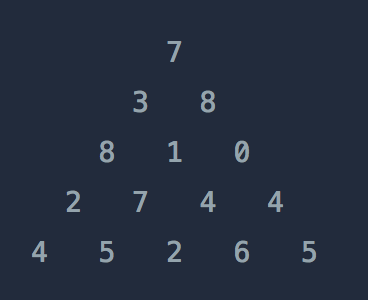

### 정수 삼각형
https://programmers.co.kr/learn/courses/30/lessons/43105

#### 문제 요약
* 다음과 같은 정수 삼각형이 있다
    * 
* 꼭대기에서 바닥까지 이동하는 경로 중에 거쳐간 숫자의 합이 가장 큰 경우를 리턴
    * 아래로 내려갈 때는 좌/우 두 개만 가능하다. ex) 두번째 줄에서 3은 8 이나 1로만 갈 수 있음

#### 문제 풀이 과정
* [1차 제출 코드](Solution1.java) - 성공
    * 가장 단순하게 이중 for문 돌려서 triangle에 합으로 채운다
        * triangle[i][0]일 때는 triangle[i - 1][0]을 더해서 저장
        * triangle[i][마지막]일 때는 triangle[i - 1][마지막]을 더해서 저장
        * 그 외엔 triangle[i][j]에 triangle[i - 1][j - 1]과 triangle[i - 1][j] 둘 중 큰 값을 더해서 저장
    * triangle 마지막 층을 정렬해서 가장 큰 값을 리턴

* [2차 제출 코드](Solution2.java) - 성공
    * 알고리즘은 달라진 게 없고 triangle[i].length를 구할 필요가 없다... 길이는 i + 1이다...